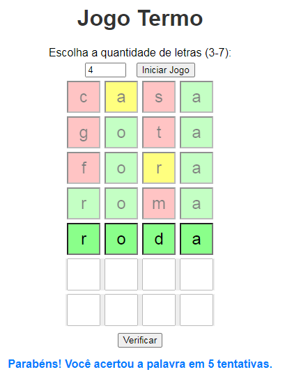

# Projeto de Jogo Termo ( JS + HTML)

Bem-vindo ao Jogo Termo! Este é um jogo de palavras onde você tenta adivinhar uma palavra oculta preenchendo as letras nas caixas correspondentes. Aqui estão as regras e instruções:

# Objetivo do Jogo
Descubra a palavra oculta preenchendo as letras nas caixas.
O jogo permite que você escolha o número de letras na palavra (entre 3 e 7).

# Como Jogar

1. Iniciar Jogo:
Escolha o número de letras para a palavra, variando de 3 a 7.
Clique no botão "Iniciar Jogo" para começar.

2. Preencher Caixas:
Após iniciar o jogo, você verá as caixas para inserir suas tentativas.
Cada linha representa uma tentativa, e você tem um número limitado de tentativas (definido pelo jogo).

3. Verificar Palavra:
Depois de preencher as letras em uma linha, clique no botão "Verificar" para verificar sua tentativa.
As caixas com letras corretas ficarão com fundo verde, e as caixas com letras erradas ficarão com fundo vermelho.

4. Dicas Adicionais:
Caixas amarelas indicam letras corretas, mas na posição errada.

5. Ganhar ou Perder:
Se você adivinhar a palavra antes de atingir o número máximo de tentativas, você ganha.
Se atingir o número máximo de tentativas sem adivinhar a palavra, você perde.

# Observações Importantes
Certifique-se de preencher todas as caixas antes de clicar em "Verificar Palavra".
O jogo informará se você ganhou ou perdeu após atingir o número máximo de tentativas.
As caixas ficarão bloqueadas ou disponíveis de acordo com o andamento do jogo.
Divirta-se jogando o Jogo Termo!

